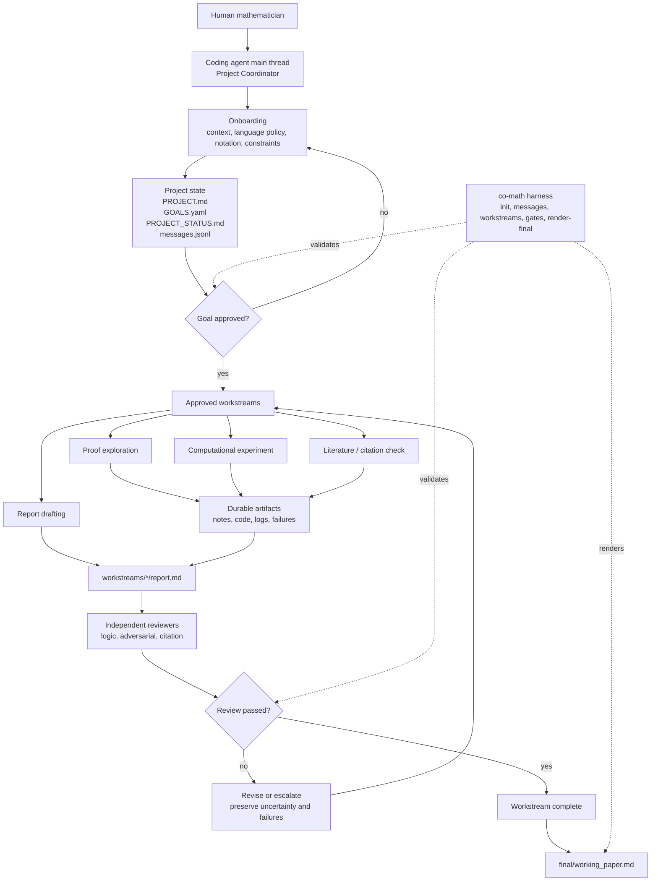

<div align="center">

# Co-Mathematician

A repository-backed mathematical research workspace for coding agents.

[中文说明](README.zh-CN.md) · [Setup](#install-and-create-projects) · [First interaction](#first-interaction) · [Updates](#version-updates) · [Architecture](#workspace-framework)


</div>

<p align="center">
  If this project helps your work, please consider giving the repository a Star.
  <a href="https://github.com/VeryMath/co-mathematician"></a>
</p>

<p align="center">
  
</p>

Co-Mathematician is a lightweight research workspace for using a repository-aware
coding agent as an AI co-mathematician. Install the `co-math` command once, then
keep every mathematical project in its own long-lived directory and optional
Git repository. Codex, Claude Code, Cursor, OpenCode, and similar tools all use
the same project files.

The core formula is:

```text
coding agent + repo filesystem + gates + reviewer loop = research workspace
```

This project is inspired by public design principles from Google DeepMind's
[AI Co-Mathematician paper](https://arxiv.org/abs/2605.06651), but it is **not**
a reproduction of their system.

## What This Workspace Does

Co-Mathematician turns a math research conversation into a file-backed project:

- the coding agent main thread acts as the Project Coordinator
- `workspace/project/` stores the research question, goals, status, and messages
- `workspace/workstreams/` stores proof, computation, literature, and review work
- reviewer agents or separate reviewer sessions check reports before completion
- `workspace/final/working_paper.md` is rendered only from reviewed reports

The Python harness does not run agents. It only initializes files, appends
messages, creates approved workstreams, checks gates, and renders the final
working paper.

## Version Updates

### 0.2.0 (2026-08-29)

- added independent, long-lived project directories with optional Git repositories
- added one canonical project Skill under `.agents/skills/` for coding agents
- added `setup`, `new`, `list`, `status`, `resume`, `next`, `archive`, and `reopen`
- kept the harness focused on project files, research state, reviews, and working papers

### 0.1.0

- introduced the repository-backed research workspace, approved goals,
  workstreams, independent review, and final working-paper flow

## Install And Create Projects

Clone Co-Math Core and install its command:

```bash
git clone https://github.com/VeryMath/co-mathematician.git
cd co-mathematician
python3 -m pip install -e .
co-math --help
```

Choose the parent directory for your projects. If you skip this command,
Co-Math uses `~/CoMathProjects`.

```bash
co-math setup --projects-home ~/CoMathProjects
```

Create the first project:

```bash
co-math new "Muon Convergence"
```

The command prints the new path. Open that directory in your coding agent, then
say:

```text
Continue this Co-Math project.
```

Every created project contains:

```text
co-math.toml
AGENTS.md
CLAUDE.md
.agents/skills/co-mathematician/SKILL.md
workspace/
```

`.agents/skills/` is the canonical Skill location. Coding agents that support
Agent Skills discover it directly. `AGENTS.md` is the general entry point, and
the short `CLAUDE.md` points Claude Code to the same instructions. There is no
separate Co-Math workflow for each coding agent.

### Daily Project Flow

```bash
co-math list
co-math resume --project ~/CoMathProjects/Muon\ Convergence
co-math next --project ~/CoMathProjects/Muon\ Convergence
co-math archive --project ~/CoMathProjects/Muon\ Convergence
co-math reopen --project ~/CoMathProjects/Muon\ Convergence
```

When project A is finished, archive it and run `co-math new "Project B"`.
Project B receives a new directory, workspace, Skill, and Git repository; no
files from project A are cleared or reused.

### Coding-Agent Setup Prompt

Any coding agent that can run terminal commands can do the setup for you:

```text
Install Co-Math from https://github.com/VeryMath/co-mathematician.git,
set ~/CoMathProjects as the projects directory, and create a project named
Muon Convergence. Return its path but do not start the research yet.
```

### Core Repository Workspace

The checked-in `workspace/` remains available for developing Co-Math itself and
for backward compatibility:

```bash
co-math init --workspace workspace
PYTHONPATH=. python3 -m harness.co_math.cli --help
```

### Project-Local Skills

For AI4Math skill libraries and project-specific research workflows, install
skills into this repository by default:

```text
.agents/skills/
```

The registry scanner discovers both `.agents/skills/<skill>/SKILL.md` and nested
layouts such as `.agents/skills/<category>/<skill>/SKILL.md`.

Use global skill roots such as `~/.codex/skills` or `~/.agents/skills` only when
you intentionally want a personal installation shared across projects.

For example, to bring a local AI4Math skill library into this workspace:

```bash
mkdir -p .agents/skills
rsync -a /path/to/AI4Math-Skill-Library/skills/ .agents/skills/
co-math refresh-skills --workspace workspace
co-math suggest-skills --workspace workspace --query "Stiefel manifold optimization"
```

`suggest-skills` refreshes the project-local registry by default, so newly copied
skills are visible to the workspace even when the coding agent's native skill
registry has not reloaded yet. If it suggests a relevant skill, ask the Project
Coordinator to read that `SKILL.md` before proposing goals or creating a
workstream.

If the user chooses to let that Skill drive the task, record a handoff:

```bash
co-math skill-handoff \
  --workspace workspace \
  --skill optimization-skill \
  --mode skill_guided \
  --reason "The task is an optimization modeling problem." \
  --query "Stiefel manifold optimization" \
  --skill-path ".agents/skills/optimization-skill/SKILL.md"
```

After handoff, follow the domain Skill's workflow for the inner task. Use the
full goal/workstream/reviewer flow only when the user wants durable research
output or a final working paper.

## First Interaction

After opening a created project directory in your coding agent, start with:

```text
Continue this Co-Math project. Read AGENTS.md and the Co-Mathematician Skill,
run `co-math resume --project .`, and guide me through onboarding.
Do not start concrete research yet.
```

The first onboarding choice should be the workspace document language policy:

1. English for all workspace documents.
2. User language for research notes, English for schemas, gates, and reviews.
3. User language for all human-readable research documents.
4. Match each project or conversation.

## Starting A Research Project

Give the agent your problem context only after onboarding starts:

```text
I want to start a mathematical research project.

Problem context:
...

Known definitions, notation, and constraints:
...

Relevant references or files:
...

Please formalize the research question and propose goals.
Do not create workstreams yet.
```

If a domain Skill is explicitly invoked, the interaction may enter
skill-guided mode instead. In that case, the Skill's own opening, modeling, and
approval rules control the next steps. Co-Mathematician records the handoff and
keeps provenance, uncertainty, failures, and final-paper gates available when
the user promotes the task into a research project.

The Project Coordinator should update:

```text
workspace/project/PROJECT.md
workspace/project/GOALS.yaml
workspace/project/PROJECT_STATUS.md
workspace/project/messages.jsonl
```

Draft goals are not executable. A goal can receive workstreams only when its
status is:

```yaml
status: approved
```

Check a goal gate:

```bash
co-math check-gate --workspace workspace --gate goal_approval --goal-id G1
```

Approve goals in chat with a clear instruction:

```text
I approve goal G1 as written.
You may create workstreams for G1.
```

## Creating Workstreams

After goal approval, ask the Project Coordinator to create focused workstreams:

```text
Create a literature workstream for approved goal G1.
The workstream should identify relevant known results, exact theorem
statements, assumptions, and citation provenance.
```

or:

```text
Create a proof exploration workstream for approved goal G1.
Preserve failed attempts and expose unresolved uncertainty in the report.
```

The harness command is:

```bash
co-math new-workstream \
  --workspace workspace \
  --goal-id G1 \
  --title "Literature baseline review" \
  --kind literature
```

Allowed workstream kinds are `proof`, `computation`, `literature`, and `review`.

Each workstream should produce a report with:

- provenance for important claims
- explicit uncertainty
- failed explorations
- independent reviewer output under `reviews/`

Check completion:

```bash
co-math check-gate \
  --workspace workspace \
  --gate workstream_completion \
  --workstream-id WS-G1-001-example
```

## Rendering The Working Paper

When workstream reports pass independent review, render the final working paper:

```bash
co-math render-final --workspace workspace
```

The output is:

```text
workspace/final/working_paper.md
```

This is a working paper, not a chat summary. It should preserve provenance,
uncertainty, failed explorations, and reviewer status.

## Workspace Framework



## Harness Commands

```bash
co-math setup --projects-home ~/CoMathProjects
co-math new "Project Name"
co-math list
co-math status --project /path/to/project
co-math resume --project /path/to/project
co-math next --project /path/to/project
co-math archive --project /path/to/project
co-math reopen --project /path/to/project
co-math init --workspace workspace
co-math refresh-skills --workspace workspace
co-math suggest-skills --workspace workspace --query "..."
co-math skill-handoff --workspace workspace --skill optimization-skill --mode skill_guided --reason "..." --query "..."
co-math append-message --workspace workspace --sender project_coordinator --recipient user --type status --content "..."
co-math new-workstream --workspace workspace --goal-id G1 --title "..." --kind proof
co-math check-gate --workspace workspace --gate goal_approval --goal-id G1
co-math check-gate --workspace workspace --gate workstream_completion --workstream-id WS-G1-001-example
co-math render-final --workspace workspace
```

## Coding-Agent Compatibility

Created projects use one standard Skill and one command. Platform-specific
files in the Core repository are only development adapters:

```text
agents/roles/       canonical, platform-neutral role cards
.codex/agents/      Codex TOML adapters
.claude/agents/     Claude Code Markdown subagent adapters
.cursor/rules/      Cursor project-rule adapters
```

| Coding agent | Created project entry | Optional Core development adapter |
| --- | --- | --- |
| Generic repository-aware agent | `AGENTS.md`, `.agents/skills/co-mathematician/SKILL.md` | none |
| Codex | same standard files | `.codex/` |
| Claude Code | `CLAUDE.md` points to the standard files | `.claude/` |
| Cursor or OpenCode | same standard files | no adapter required for project lifecycle |

If your coding-agent environment has no native subagent feature, use a fresh
reviewer prompt or a separate session and save the review under the workstream
`reviews/` directory.

## Created Project Layout

```text
co-math.toml
AGENTS.md
CLAUDE.md
.agents/skills/co-mathematician/
workspace/
```

## Source Checks

```bash
PYTHONDONTWRITEBYTECODE=1 PYTHONPATH=. python3 -m harness.co_math.cli --help
python3 -m pip wheel --no-deps --no-build-isolation .
```

## License

MIT. See `LICENSE`.
