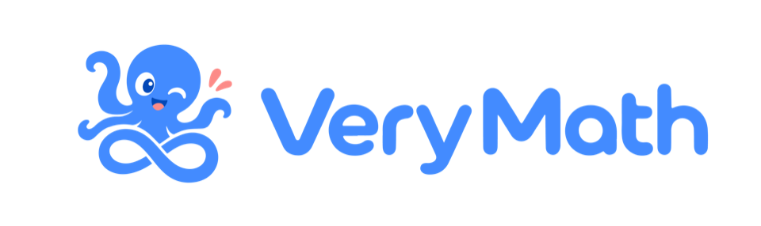
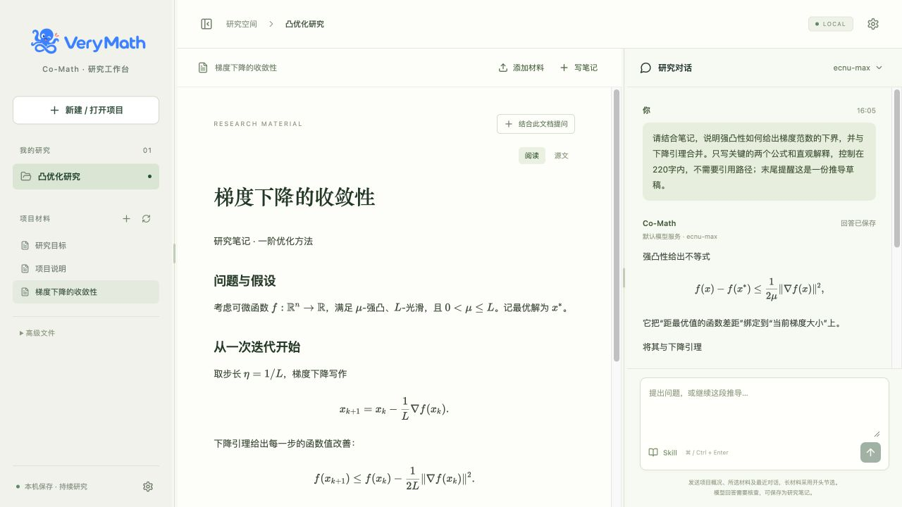
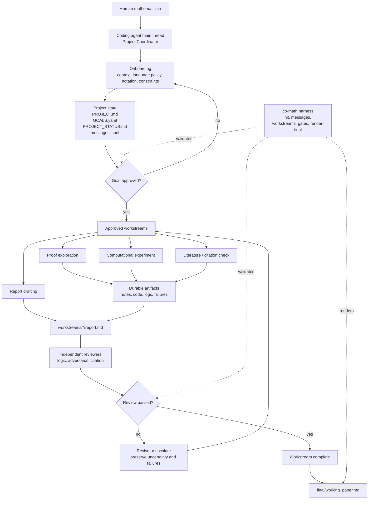

<div align="center">



# Co-Mathematician

A local workspace for mathematical questions, source materials, formulas, and model conversations.

[中文说明](README.zh-CN.md) · [Quick Start](#web-quick-start) · [Architecture](#architecture) · [Full Guide](docs/local-web.md)

 [](https://github.com/VeryMath/co-mathematician) 

</div>

Co-Mathematician keeps mathematical research in a lasting project. Read, discuss, and take notes in the browser, then continue computation, proofs, and review with a coding agent.

<a id="architecture"></a>

<p align="center">
  
</p>
<p align="center">
  From problem clarification to independent review and research outputs. The web workbench shares the project files; external coding agents drive research execution.
</p>

## Inside the Workbench

<p align="center">
  
</p>

Read formulas, ask about selected materials, and save research notes. This screenshot uses an independent example project and an actual model reply. Drag either vertical divider to adjust the layout.

## Web Quick Start

Requires **Python 3.10+**, **Node.js 22.19+**, and Git. In the commands below, `python3` must refer to a supported Python version. Actual runs and UI checks have been performed on macOS; Windows and Linux have not been fully verified.

### 1. Install and start

macOS / Linux terminal:

```bash
git clone https://github.com/VeryMath/co-mathematician.git
cd co-mathematician
python3 -m venv .venv
source .venv/bin/activate
python -m pip install -e .
npm install --package-lock=false
co-math setup --projects-home "$HOME/Desktop/CoMathProjects"
npm run build
CO_MATH_PYTHON=python npm start
```

Leave the terminal running and open **[http://127.0.0.1:4175](http://127.0.0.1:4175)**.

The setup command places **new projects** in `CoMathProjects` on your desktop. You can choose another directory; without setup, the application defaults to `~/CoMathProjects`. Existing projects are not moved automatically.

<details>
<summary>Windows PowerShell installation</summary>

For Windows PowerShell, the equivalent commands are below (not fully verified):

```powershell
git clone https://github.com/VeryMath/co-mathematician.git
cd co-mathematician
py -3 -m venv .venv
.\.venv\Scripts\python.exe -m pip install -e .
npm install --package-lock=false
.\.venv\Scripts\co-math.exe setup --projects-home "$HOME\Desktop\CoMathProjects"
npm run build
$env:CO_MATH_PYTHON = (Resolve-Path .\.venv\Scripts\python.exe).Path
npm start
```

</details>

<details>
<summary>Restarting and updating</summary>

For subsequent starts, enter the repository, activate the Python environment, and run `CO_MATH_PYTHON=python npm start`. Reinstall dependencies and run `npm run build` after updating the source. This release runs locally from source; a desktop installer is not included.

</details>

### 2. Configure a model

Open settings in the upper-right corner, choose a service, enter your API key, select a model, and save.

- **ECNU** has its service address prefilled; supply your own key and choose a model.
- For **other compatible services**, enter the base URL, key, and model ID. You can request the model list or enter it manually.
- Keep multiple service profiles and switch services or models from the conversation header. A running reply retains the configuration captured when it started.
- Keys stay in server process memory and must be entered again after a restart. Non-secret settings are saved. `LLM_API_KEY`, `LLM_BASE_URL`, and `LLM_MODEL_ID` can provide the default profile; see the [workbench guide](docs/local-web.md).

**An API key is not needed to create projects or add and read materials.** Actual provider requests have been verified with ECNU `ecnu-max` and `ecnu-plus`; other services have not been individually verified.

### 3. Start researching

1. Create a project with a name and research question. To continue an existing project, click it in the saved list or browse to its folder; the application recognizes it automatically.
2. Add materials using the file picker or drag files into the workspace. Multiple files are supported; duplicate names are saved separately.
3. Open a material, add it to the conversation, and ask a question.
4. Save useful replies as research notes. Projects, materials, and saved conversations remain available after refreshing or restarting.
5. Drag the vertical dividers to resize the panels; double-click to restore defaults. Narrow windows use document and conversation tabs.

## Current Capabilities and Limits

| Feature | Available in this release |
| --- | --- |
| Projects | Create, browse folders, reopen existing research, and read structured research goals |
| Materials | PDF, Word (`.docx`), Markdown, TXT, LaTeX, CSV, JSON/YAML, Python, Lean, and BibTeX; up to 10 MB per file and 10 files per batch |
| Formulas | Math in Markdown, TXT, LaTeX, research goals, and conversations; common native Word equations; reading/source views |
| PDF | Original pages, page navigation, and text extraction; bundled character maps and standard fonts |
| Conversations | Multiple service profiles, model switching, streamed replies, cancellation, saved history, and notes |
| VeryMath Skills | Connect a local Skill library, search methods, and use instructions and supported references in a conversation |
| Interface | VeryMath branding, compact model selection, and resizable panels with remembered widths |

Text formulas need `$…$`, `$$…$$`, `\(...\)`, or `\[…\]` delimiters, for example `The gradient is $\nabla f(x)$`. Ordinary prose is not guessed to be math. LaTeX support is a formula preview, not a full document compiler; use the compiled PDF for complete typesetting. Unsupported formulas keep their source or receive a notice to check the original. **OCR and image-equation recognition are not included.**

VeryMath Skills currently provide **workflow guidance**: the application reads `SKILL.md` and supported references so the model can follow the method. Selecting a Skill does not install dependencies or execute commands, Lean, solvers, or independent reviewers. See [Skill integration](docs/skills-integration.md) for connection instructions, capacity limits, and interfaces.

The web model has no command execution, arbitrary file-write, or web-search tools. Mathematical replies are drafts requiring review; saving one does not verify a proof. The original CLI research branches, computations, and reviews are driven by an external coding agent. Electron packaging and a web interface for independent review are not implemented.

## Where Projects and Data Are Saved

The new-project dialog shows the storage location. A project contains:

```text
your-project/
├── co-math.toml
├── .agents/skills/                 # Project-local research methods
├── workspace/project/
│   ├── PROJECT.md                  # Project overview
│   ├── GOALS.yaml                  # Research question and goals
│   ├── materials/                  # Imported original materials
│   └── notes/                      # Saved research notes
└── .co-math/web/conversation.json   # Web conversation history
```

The web workbench adds a Git ignore rule for `.co-math/` in both new and existing projects so ordinary commits exclude conversations. Ignore rules do not affect files that were already explicitly tracked by Git.

Model settings and the opened-project list default to `~/.config/co-math/`; keys are not written there. Research files and conversation history are stored locally. **Sending a question transmits the project overview, selected material text, and recent conversation to your chosen model service**; selected Skill instructions are included as well.

Each request can include up to six selected materials, with leading excerpts used for long files. The PDF reader can display every original page, but text extraction reads at most the first 40 pages. The model receives extracted text, not the full PDF page images. See the [workbench guide](docs/local-web.md) for detailed limits, data locations, and operation.

## Version Updates

<details>
<summary>0.3.0 and earlier releases</summary>

### 0.3.0 (2026-09-26)

- added the local web workbench with project creation and folder browsing
- added independent model-service profiles, model switching, streaming, cancellation, and saved conversations
- added material imports, PDF original-page reading, formula previews, and saved research notes
- added local VeryMath Skill guidance, readable research goals, and resizable panels
- retained the existing CLI and project layout; see the capabilities and limits above

### 0.2.0 (2026-08-29)

- added independent, long-lived project directories with optional Git repositories
- added one canonical project Skill under `.agents/skills/` for coding agents
- added `setup`, `new`, `list`, `status`, `resume`, `next`, `archive`, and `reopen`
- kept the harness focused on project files, research state, reviews, and working papers

### 0.1.0

- introduced the repository-backed research workspace, approved goals,
  workstreams, independent review, and final working-paper flow

</details>

## Install And Create Projects

<details>
<summary>CLI installation, research workflow, and agent integrations</summary>

The following section covers the original coding-agent/CLI workflow. If you followed the web quick start, the Python command is already installed.

Clone Co-Math Core and install its command:

```bash
git clone https://github.com/VeryMath/co-mathematician.git
cd co-mathematician
python3 -m pip install -e .
co-math --help
```

Choose the parent directory for your projects. If you skip this command,
Co-Math uses `~/CoMathProjects`.

```bash
co-math setup --projects-home ~/CoMathProjects
```

Create the first project:

```bash
co-math new "Muon Convergence"
```

The command prints the new path. Open that directory in your coding agent, then
say:

```text
Continue this Co-Math project.
```

Every created project contains:

```text
co-math.toml
AGENTS.md
CLAUDE.md
.agents/skills/co-mathematician/SKILL.md
workspace/
```

`.agents/skills/` is the canonical Skill location. Coding agents that support
Agent Skills discover it directly. `AGENTS.md` is the general entry point, and
the short `CLAUDE.md` points Claude Code to the same instructions. There is no
separate Co-Math workflow for each coding agent.

### Daily Project Flow

```bash
co-math list
co-math resume --project ~/CoMathProjects/Muon\ Convergence
co-math next --project ~/CoMathProjects/Muon\ Convergence
co-math archive --project ~/CoMathProjects/Muon\ Convergence
co-math reopen --project ~/CoMathProjects/Muon\ Convergence
```

When project A is finished, archive it and run `co-math new "Project B"`.
Project B receives a new directory, workspace, Skill, and Git repository; no
files from project A are cleared or reused.

### Coding-Agent Setup Prompt

Any coding agent that can run terminal commands can do the setup for you:

```text
Install Co-Math from https://github.com/VeryMath/co-mathematician.git,
set ~/CoMathProjects as the projects directory, and create a project named
Muon Convergence. Return its path but do not start the research yet.
```

### Core Repository Workspace

The checked-in `workspace/` remains available for developing Co-Math itself and
for backward compatibility:

```bash
co-math init --workspace workspace
PYTHONPATH=. python3 -m harness.co_math.cli --help
```

### Project-Local Skills

For AI4Math skill libraries and project-specific research workflows, install
skills into this repository by default:

```text
.agents/skills/
```

The registry scanner discovers both `.agents/skills/<skill>/SKILL.md` and nested
layouts such as `.agents/skills/<category>/<skill>/SKILL.md`.

Use global skill roots such as `~/.codex/skills` or `~/.agents/skills` only when
you intentionally want a personal installation shared across projects.

For example, to bring a local AI4Math skill library into this workspace:

```bash
mkdir -p .agents/skills
rsync -a /path/to/AI4Math-Skill-Library/skills/ .agents/skills/
co-math refresh-skills --workspace workspace
co-math suggest-skills --workspace workspace --query "Stiefel manifold optimization"
```

`suggest-skills` refreshes the project-local registry by default, so newly copied
skills are visible to the workspace even when the coding agent's native skill
registry has not reloaded yet. If it suggests a relevant skill, ask the Project
Coordinator to read that `SKILL.md` before proposing goals or creating a
workstream.

If the user chooses to let that Skill drive the task, record a handoff:

```bash
co-math skill-handoff \
  --workspace workspace \
  --skill optimization-skill \
  --mode skill_guided \
  --reason "The task is an optimization modeling problem." \
  --query "Stiefel manifold optimization" \
  --skill-path ".agents/skills/optimization-skill/SKILL.md"
```

After handoff, follow the domain Skill's workflow for the inner task. Use the
full goal/workstream/reviewer flow only when the user wants durable research
output or a final working paper.

## First Interaction

After opening a created project directory in your coding agent, start with:

```text
Continue this Co-Math project. Read AGENTS.md and the Co-Mathematician Skill,
run `co-math resume --project .`, and guide me through onboarding.
Do not start concrete research yet.
```

The first onboarding choice should be the workspace document language policy:

1. English for all workspace documents.
2. User language for research notes, English for schemas, gates, and reviews.
3. User language for all human-readable research documents.
4. Match each project or conversation.

## Starting A Research Project

Give the agent your problem context only after onboarding starts:

```text
I want to start a mathematical research project.

Problem context:
...

Known definitions, notation, and constraints:
...

Relevant references or files:
...

Please formalize the research question and propose goals.
Do not create workstreams yet.
```

If a domain Skill is explicitly invoked, the interaction may enter
skill-guided mode instead. In that case, the Skill's own opening, modeling, and
approval rules control the next steps. Co-Mathematician records the handoff and
keeps provenance, uncertainty, failures, and final-paper gates available when
the user promotes the task into a research project.

The Project Coordinator should update:

```text
workspace/project/PROJECT.md
workspace/project/GOALS.yaml
workspace/project/PROJECT_STATUS.md
workspace/project/messages.jsonl
```

Draft goals are not executable. A goal can receive workstreams only when its
status is:

```yaml
status: approved
```

Check a goal gate:

```bash
co-math check-gate --workspace workspace --gate goal_approval --goal-id G1
```

Approve goals in chat with a clear instruction:

```text
I approve goal G1 as written.
You may create workstreams for G1.
```

## Creating Workstreams

After goal approval, ask the Project Coordinator to create focused workstreams:

```text
Create a literature workstream for approved goal G1.
The workstream should identify relevant known results, exact theorem
statements, assumptions, and citation provenance.
```

or:

```text
Create a proof exploration workstream for approved goal G1.
Preserve failed attempts and expose unresolved uncertainty in the report.
```

The harness command is:

```bash
co-math new-workstream \
  --workspace workspace \
  --goal-id G1 \
  --title "Literature baseline review" \
  --kind literature
```

Allowed workstream kinds are `proof`, `computation`, `literature`, and `review`.

Each workstream should produce a report with:

- provenance for important claims
- explicit uncertainty
- failed explorations
- independent reviewer output under `reviews/`

Check completion:

```bash
co-math check-gate \
  --workspace workspace \
  --gate workstream_completion \
  --workstream-id WS-G1-001-example
```

## Rendering The Working Paper

When workstream reports pass independent review, render the final working paper:

```bash
co-math render-final --workspace workspace
```

The output is:

```text
workspace/final/working_paper.md
```

This is a working paper, not a chat summary. It should preserve provenance,
uncertainty, failed explorations, and reviewer status.

## Workspace Framework

The diagram below describes the external coding-agent workflow. The web workbench shares its project files, but does not execute these agents or reviews.



## Harness Commands

```bash
co-math setup --projects-home ~/CoMathProjects
co-math new "Project Name"
co-math list
co-math status --project /path/to/project
co-math resume --project /path/to/project
co-math next --project /path/to/project
co-math archive --project /path/to/project
co-math reopen --project /path/to/project
co-math init --workspace workspace
co-math refresh-skills --workspace workspace
co-math suggest-skills --workspace workspace --query "..."
co-math skill-handoff --workspace workspace --skill optimization-skill --mode skill_guided --reason "..." --query "..."
co-math append-message --workspace workspace --sender project_coordinator --recipient user --type status --content "..."
co-math new-workstream --workspace workspace --goal-id G1 --title "..." --kind proof
co-math check-gate --workspace workspace --gate goal_approval --goal-id G1
co-math check-gate --workspace workspace --gate workstream_completion --workstream-id WS-G1-001-example
co-math render-final --workspace workspace
```

## Coding-Agent Compatibility

Created projects use one standard Skill and one command. Platform-specific
files in the Core repository are only development adapters:

```text
agents/roles/       canonical, platform-neutral role cards
.codex/agents/      Codex TOML adapters
.claude/agents/     Claude Code Markdown subagent adapters
.cursor/rules/      Cursor project-rule adapters
```

| Coding agent | Created project entry | Optional Core development adapter |
| --- | --- | --- |
| Generic repository-aware agent | `AGENTS.md`, `.agents/skills/co-mathematician/SKILL.md` | none |
| Codex | same standard files | `.codex/` |
| Claude Code | `CLAUDE.md` points to the standard files | `.claude/` |
| Cursor or OpenCode | same standard files | no adapter required for project lifecycle |

If your coding-agent environment has no native subagent feature, use a fresh
reviewer prompt or a separate session and save the review under the workstream
`reviews/` directory.

## Created Project Layout

```text
co-math.toml
AGENTS.md
CLAUDE.md
.agents/skills/co-mathematician/
workspace/
```

</details>

## Source Checks

```bash
PYTHONDONTWRITEBYTECODE=1 PYTHONPATH=. python3 -m harness.co_math.cli --help
python3 -m pip wheel --no-deps --no-build-isolation .
npm run check
npm run build
```

## Inspiration and License

This project draws on public design principles from Google DeepMind's [AI Co-Mathematician paper](https://arxiv.org/abs/2605.06651). It is not a reproduction of that system.

MIT. See `LICENSE`. Bundled brand and PDF assets retain their original licenses; see [third-party assets](docs/third-party-assets.md).
