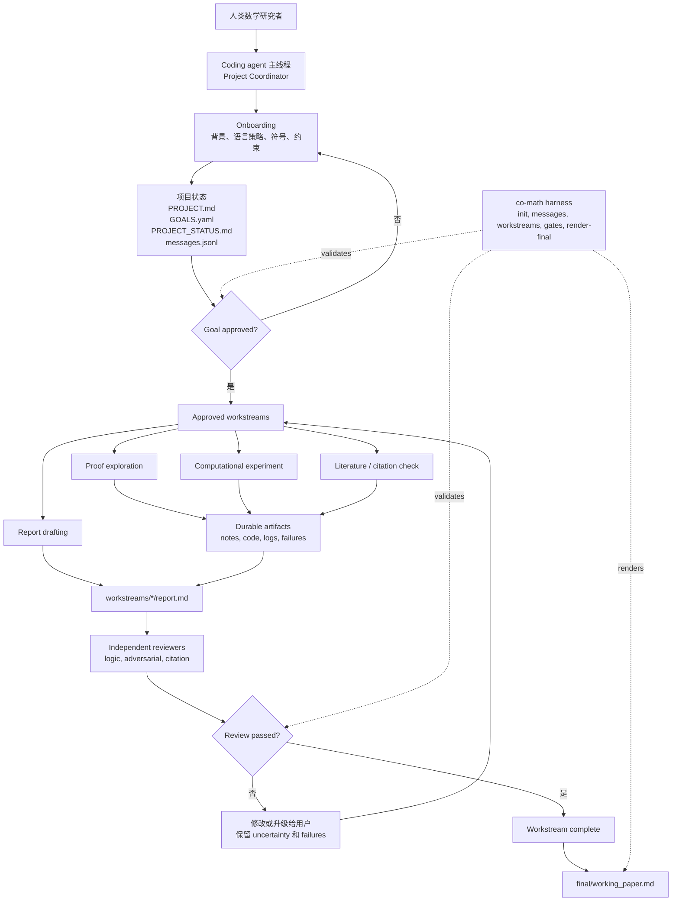

<div align="center">


# Co-Mathematician

把数学问题、研究材料、公式推导和模型对话放进同一个本地工作区。

[English](README.md) · [网页版快速开始](#网页版快速开始) · [功能与限制](#当前能力与限制) · [命令行用法](#安装并创建项目) · [版本更新](#版本更新)


</div>

<p align="center">
  如果这个项目对你有帮助，欢迎为仓库点 Star。
  <a href="https://github.com/VeryMath/co-mathematician"></a>
</p>

Co-Mathematician 提供两种共用项目文件的使用方式：

| 使用方式 | 适合做什么 | 如何开始 |
| --- | --- | --- |
| **本地网页版** | 阅读材料、显示公式、与模型讨论、保存笔记 | 按下方步骤启动，在浏览器中操作 |
| **Coding agent + 命令行** | 让 Codex、Claude Code、Cursor、OpenCode 等继续研究，组织计算、证明和独立审查 | 用 coding agent 打开项目目录，见[命令行用法](#安装并创建项目) |

每个数学项目有独立的文件夹，可以长期保存，并继续交给其他工具使用。网页对话不会自动把研究目标标记为完成。

本项目受 Google DeepMind [AI Co-Mathematician 论文](https://arxiv.org/abs/2605.06651)中的公开设计原则启发，**不是对其系统的复现**。

## 网页版快速开始

需要 **Python 3.10+**、**Node.js 22.19+** 和 Git。下面的 `python3` 必须对应满足版本要求的 Python。当前实际运行与界面检查在 macOS 上完成；Windows、Linux 尚未完整验证。

### 1. 安装并启动

macOS / Linux 终端：

```bash
git clone https://github.com/VeryMath/co-mathematician.git
cd co-mathematician
python3 -m venv .venv
source .venv/bin/activate
python -m pip install -e .
npm install --package-lock=false
co-math setup --projects-home "$HOME/Desktop/CoMathProjects"
npm run build
CO_MATH_PYTHON=python npm start
```

保持这个终端运行，打开 **[http://127.0.0.1:4175](http://127.0.0.1:4175)**。

上面的设置命令将**之后新建的项目**放在桌面的 `CoMathProjects` 文件夹。可以换成自己喜欢的位置；未设置时程序默认使用 `~/CoMathProjects`。已有项目不会自动搬家。

Windows PowerShell 可使用以下命令安装和启动（尚未完整验证）：

```powershell
git clone https://github.com/VeryMath/co-mathematician.git
cd co-mathematician
py -3 -m venv .venv
.\.venv\Scripts\python.exe -m pip install -e .
npm install --package-lock=false
.\.venv\Scripts\co-math.exe setup --projects-home "$HOME\Desktop\CoMathProjects"
npm run build
$env:CO_MATH_PYTHON = (Resolve-Path .\.venv\Scripts\python.exe).Path
npm start
```

后续启动：进入仓库、激活 Python 环境，再运行 `CO_MATH_PYTHON=python npm start`；源码更新后重新安装依赖并执行 `npm run build`。本版为从源码运行的本机服务，还没有一键安装包。

### 2. 配置模型

点击右上角设置，选择服务、填写 API Key、选择模型，然后“保存并使用”。

- **华师大 ECNU**：服务地址已预填，填写自己的密钥并选择模型。
- **其他兼容服务**：填写基础地址、密钥和模型名称；可以尝试“获取模型”，也可以手动填写。
- 可保存多个服务配置，在对话栏顶部切换服务或模型；正在生成的回答继续使用发起时的配置。
- 密钥仅保存在服务进程的内存里，重启后需要重新填写。非秘密配置会保存。也支持通过 `LLM_API_KEY`、`LLM_BASE_URL`、`LLM_MODEL_ID` 提供默认配置，见[详细说明](docs/local-web.md)。

**没有 API Key 也能创建项目、添加和阅读材料。** 当前实际模型请求验证覆盖 ECNU 的 `ecnu-max` 和 `ecnu-plus`；其他服务未逐一验证。

### 3. 开始研究

1. 点击“新建 / 打开项目”，填写名称与研究问题。已有项目可以从列表直接继续，也可以浏览文件夹，由程序自动识别。
2. 点击“添加材料”，或把文件拖到工作区。可以一次添加多份材料，同名文件会另存。
3. 打开材料，点击“结合此文档提问”，再在右侧输入问题。
4. 有用的回答可以“保存为笔记”。刷新或重启后，项目、材料和已保存的对话仍可继续使用。
5. 拖动两条竖向分隔线调整各栏宽度；双击恢复默认。窄窗口使用“研究材料 / 模型对话”页签。

## 当前能力与限制

| 功能 | 本版支持 |
| --- | --- |
| 项目 | 新建、浏览文件夹打开、继续已有研究；可读的研究目标页面 |
| 材料 | PDF、Word（`.docx`）、Markdown、TXT、LaTeX、CSV、JSON/YAML、Python、Lean、BibTeX；每份最多 10 MB，每批最多 10 份 |
| 公式 | Markdown、TXT、LaTeX、研究目标和对话的公式排版；Word 常见原生公式；“阅读 / 源文”切换 |
| PDF | 原始页面阅读、翻页与文字提取；中文字符映射和标准字体随应用提供 |
| 模型对话 | 多服务配置、模型切换、流式回答、停止生成、保存历史和研究笔记 |
| VeryMath Skill | 连接本机 Skill 库，搜索并选择方法，把说明与支持的参考文字用于本轮对话 |
| 界面 | VeryMath 品牌、可收起的模型选择、可拖动并记住宽度的分栏 |

文本公式须使用 `$…$`、`$$…$$`、`\(...\)` 或 `\[…\]` 标记，例如 `梯度为 $\nabla f(x)$`。普通文字不会被猜测成公式。LaTeX 是公式预览，完整论文排版仍以编译后的 PDF 为准；不支持的公式会保留原式或提示对照原文件。**没有扫描文字或图片公式识别。**

VeryMath Skill 当前提供**流程指导**：读取 `SKILL.md` 和支持的包内参考资料，让模型按其方法分析。选择 Skill 不会自动安装依赖，也不会执行命令、Lean、求解器或独立审稿。具体连接方式、容量与接口见 [Skill 接入说明](docs/skills-integration.md)。

网页模型没有命令执行、任意文件写入或联网检索工具。数学回答属于草稿，仍需核查；保存回答不表示证明已验证。旧命令行的计算、工作分支和审查流程由外部 coding agent 驱动。Electron 桌面安装包和网页内的独立审稿界面尚未实现。

## 项目与数据保存在哪里

项目位置在新建界面可见。主要文件如下：

```text
你的项目/
├── co-math.toml
├── .agents/skills/                 # 项目自己的研究方法
├── workspace/project/
│   ├── PROJECT.md                  # 项目说明
│   ├── GOALS.yaml                  # 研究问题和目标
│   ├── materials/                  # 添加的原始材料
│   └── notes/                      # 保存的研究笔记
└── .co-math/web/conversation.json   # 网页对话历史
```

网页会为新建和已有项目补上 `.co-math/` 的 Git 忽略规则，避免日常提交带上对话。已经被手动加入 Git 跟踪的文件不受忽略规则影响。

模型服务配置和已打开项目列表默认位于 `~/.config/co-math/`；密钥不写入这些文件。项目资料与聊天历史保存在本机，**点击发送后，项目概况、选中的材料文字和最近对话会发给你选择的模型服务**；使用 Skill 时也会发送相应方法说明。

每轮最多选择六份材料，长材料使用开头节选。PDF 原文可以阅读全部页面，但文字提取最多读取前 40 页；模型读取的是提取文字，不是完整 PDF 页面图像。更详细的容量、存储位置和运行方式见[工作台使用说明](docs/local-web.md)。

## 版本更新

### 0.3.0 (2026-09-26)

- 新增本地研究工作台，支持创建项目、浏览文件夹和继续研究
- 新增独立模型服务配置、模型切换、流式回答、停止与对话保存
- 新增材料导入、PDF 原文阅读、公式预览与研究笔记保存
- 新增本机 VeryMath Skill 流程指导、可读研究目标与可拖动分栏
- 保留原有命令行和项目文件布局；具体能力与限制见上文

### 0.2.0 (2026-08-29)

- 支持独立、可长期维护的项目目录和可选 Git 仓库
- 在 `.agents/skills/` 提供一份供 coding agent 使用的项目级 Skill
- 新增 `setup`、`new`、`list`、`status`、`resume`、`next`、`archive` 和 `reopen`
- harness 继续只管理项目文件、研究状态、审查和 working paper

### 0.1.0

- 建立仓库化研究工作区、目标批准、workstream、独立审查和最终 working paper 流程

## 安装并创建项目

以下保留原有 coding agent / 命令行用法。已完成上方网页快速开始的用户，无需重复安装 Python 命令。

clone Co-Math Core 并安装命令：

```bash
git clone https://github.com/VeryMath/co-mathematician.git
cd co-mathematician
python3 -m pip install -e .
co-math --help
```

指定所有数学项目的父目录。不执行这一步时，默认使用 `~/CoMathProjects`。

```bash
co-math setup --projects-home ~/CoMathProjects
```

创建第一个项目：

```bash
co-math new "Muon Convergence"
```

命令会返回新项目路径。用任意 coding agent 打开该目录，然后说：

```text
继续这个 Co-Math 项目。
```

每个新项目都包含：

```text
co-math.toml
AGENTS.md
CLAUDE.md
.agents/skills/co-mathematician/SKILL.md
workspace/
```

`.agents/skills/` 是唯一完整 Skill 的位置。支持 Agent Skills 的 coding agent 会
直接发现它；`AGENTS.md` 是通用入口，简短的 `CLAUDE.md` 让 Claude Code 指向同一
份说明。Co-Math 不为不同 coding agent 维护多套工作流。

### 日常项目流程

```bash
co-math list
co-math resume --project ~/CoMathProjects/Muon\ Convergence
co-math next --project ~/CoMathProjects/Muon\ Convergence
co-math archive --project ~/CoMathProjects/Muon\ Convergence
co-math reopen --project ~/CoMathProjects/Muon\ Convergence
```

项目 A 完成后先归档，再运行 `co-math new "Project B"`。项目 B 会得到新的目录、
workspace、Skill 和 Git 仓库，不会清空或复用项目 A 的研究文件。

### 让 Coding Agent 帮你设置

任何能执行终端命令的 coding agent 都可以完成设置：

```text
请从 https://github.com/VeryMath/co-mathematician.git 安装 Co-Math，
把 ~/CoMathProjects 设为项目目录，然后创建名为 Muon Convergence 的项目。
只返回项目路径，现在不要开始研究。
```

### Core 仓库内工作区

仓库自带的 `workspace/` 继续用于开发 Co-Math 本身和兼容旧流程：

```bash
co-math init --workspace workspace
PYTHONPATH=. python3 -m harness.co_math.cli --help
```

### 项目级 Skills

为了兼容 AI4Math 的大量 skill libraries 和项目特定研究流程，默认把 skills
安装或复制到当前仓库：

```text
.agents/skills/
```

registry scanner 会发现 `.agents/skills/<skill>/SKILL.md`，也会发现类似
`.agents/skills/<category>/<skill>/SKILL.md` 的嵌套布局。

只有当你明确想要“跨项目共享的个人安装”时，才使用 `~/.codex/skills` 或
`~/.agents/skills` 这样的全局 skill root。

例如，把本地 AI4Math skill library 放进这个工作区：

```bash
mkdir -p .agents/skills
rsync -a /path/to/AI4Math-Skill-Library/skills/ .agents/skills/
co-math refresh-skills --workspace workspace
co-math suggest-skills --workspace workspace --query "Stiefel manifold optimization"
```

`suggest-skills` 默认会先刷新项目级 registry，所以即使 coding agent 的原生 skill
registry 还没重新加载，新复制进来的 skills 也会被工作区看见。如果它推荐了相关
skill，就要求 Project Coordinator 在提出 goals 或创建 workstream 前先阅读对应的
`SKILL.md`。

如果用户决定让这个 Skill 接管内部任务流程，就记录 handoff：

```bash
co-math skill-handoff \
  --workspace workspace \
  --skill optimization-skill \
  --mode skill_guided \
  --reason "The task is an optimization modeling problem." \
  --query "Stiefel manifold optimization" \
  --skill-path ".agents/skills/optimization-skill/SKILL.md"
```

handoff 之后，内部步骤按 domain Skill 自己的流程走。只有当用户希望把任务提升为
durable research output 或 final working paper 时，才进入完整的
goal/workstream/reviewer 流程。

## 第一次交互

用 coding agent 打开新建的项目目录后，可以直接说：

```text
继续这个 Co-Math 项目。请读取 AGENTS.md 和 Co-Mathematician Skill，
运行 `co-math resume --project .`，然后带我完成 onboarding。
现在不要开始具体研究。
```

onboarding 的第一个偏好问题应该是文档语言策略：

1. 所有 workspace documents 都用英文。
2. research notes 用用户语言，schemas、gates、reviews 用英文。
3. 所有人类可读 research documents 都用用户语言。
4. 跟随每个 project 或 conversation 的语言。

## 开始一个数学研究项目

onboarding 开始后，再把问题背景给 agent：

```text
我想开始一个数学研究项目。

问题背景：
...

已知定义、符号和约束：
...

相关文献、文件或上下文：
...

请先 formalize research question，并提出 proposed goals。
现在不要创建 workstreams。
```

如果用户明确调用了某个 domain Skill，也可以进入 skill-guided mode。此时下一步
由该 Skill 自己的 opening、modeling 和 approval rules 控制；Co-Mathematician
只记录 handoff，并在任务被提升为研究项目时继续提供 provenance、uncertainty、
failures 和 final-paper gates。

Project Coordinator 应更新：

```text
workspace/project/PROJECT.md
workspace/project/GOALS.yaml
workspace/project/PROJECT_STATUS.md
workspace/project/messages.jsonl
```

draft goal 不可执行。只有当 goal 状态是下面这样，才能启动 workstream：

```yaml
status: approved
```

检查 goal gate：

```bash
co-math check-gate --workspace workspace --gate goal_approval --goal-id G1
```

在对话里明确 approve：

```text
我批准 goal G1，按当前写法执行。
你现在可以为 G1 创建 workstreams。
```

## 创建 Workstreams

goal approval 之后，再让 Project Coordinator 创建聚焦的 workstreams：

```text
请为已批准的 goal G1 创建一个 literature workstream。
这个 workstream 需要找出相关已知结果、精确的 theorem statements、
适用假设，以及 citation provenance。
```

或者：

```text
请为已批准的 goal G1 创建一个 proof exploration workstream。
请保存失败尝试，并在 report 中显式暴露 unresolved uncertainty。
```

harness 命令是：

```bash
co-math new-workstream \
  --workspace workspace \
  --goal-id G1 \
  --title "Literature baseline review" \
  --kind literature
```

允许的 workstream kind 是 `proof`、`computation`、`literature` 和 `review`。

每个 workstream report 应包含：

- 重要 claims 的 provenance
- 显式 uncertainty
- failed explorations
- `reviews/` 下的独立 reviewer output

检查 completion：

```bash
co-math check-gate \
  --workspace workspace \
  --gate workstream_completion \
  --workstream-id WS-G1-001-example
```

## 渲染 Working Paper

当 workstream reports 通过独立审查后，渲染 final working paper：

```bash
co-math render-final --workspace workspace
```

输出位置是：

```text
workspace/final/working_paper.md
```

这是 working paper，不是聊天总结。它应该保留 provenance、uncertainty、
failed explorations 和 reviewer status。

## 工作区框架

下图描述由外部 coding agent 驱动的研究流程。网页版共用项目文件，但不会自动执行图中的 agent 或审稿步骤。



## Harness 命令

```bash
co-math setup --projects-home ~/CoMathProjects
co-math new "Project Name"
co-math list
co-math status --project /path/to/project
co-math resume --project /path/to/project
co-math next --project /path/to/project
co-math archive --project /path/to/project
co-math reopen --project /path/to/project
co-math init --workspace workspace
co-math refresh-skills --workspace workspace
co-math suggest-skills --workspace workspace --query "..."
co-math skill-handoff --workspace workspace --skill optimization-skill --mode skill_guided --reason "..." --query "..."
co-math append-message --workspace workspace --sender project_coordinator --recipient user --type status --content "..."
co-math new-workstream --workspace workspace --goal-id G1 --title "..." --kind proof
co-math check-gate --workspace workspace --gate goal_approval --goal-id G1
co-math check-gate --workspace workspace --gate workstream_completion --workstream-id WS-G1-001-example
co-math render-final --workspace workspace
```

## Coding Agent 兼容性

新建项目只使用一个标准 Skill 和一套命令。Core 仓库内的平台文件仅用于开发：

```text
agents/roles/       canonical, platform-neutral role cards
.codex/agents/      Codex TOML adapters
.claude/agents/     Claude Code Markdown subagent adapters
.cursor/rules/      Cursor project-rule adapters
```

| Coding agent | 新建项目入口 | 可选 Core 开发适配 |
| --- | --- | --- |
| 通用 repository-aware agent | `AGENTS.md`、`.agents/skills/co-mathematician/SKILL.md` | 不需要 |
| Codex | 同一套标准文件 | `.codex/` |
| Claude Code | `CLAUDE.md` 指向标准文件 | `.claude/` |
| Cursor 或 OpenCode | 同一套标准文件 | 项目生命周期不需要额外适配 |

如果你的 coding-agent 环境没有原生 subagent 功能，就使用 fresh reviewer prompt
或独立 session，并把 review 保存到 workstream 的 `reviews/` 目录。

## 新建项目结构

```text
co-math.toml
AGENTS.md
CLAUDE.md
.agents/skills/co-mathematician/
workspace/
```

## 源码检查

```bash
PYTHONDONTWRITEBYTECODE=1 PYTHONPATH=. python3 -m harness.co_math.cli --help
python3 -m pip wheel --no-deps --no-build-isolation .
npm run check
npm run build
```

## 许可证

MIT。见 `LICENSE`。品牌与 PDF 资源保留各自的原始许可证，见[第三方资源说明](docs/third-party-assets.md)。
