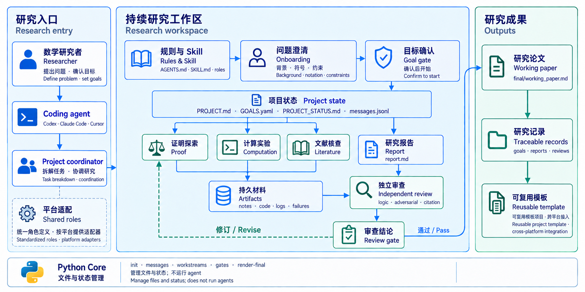
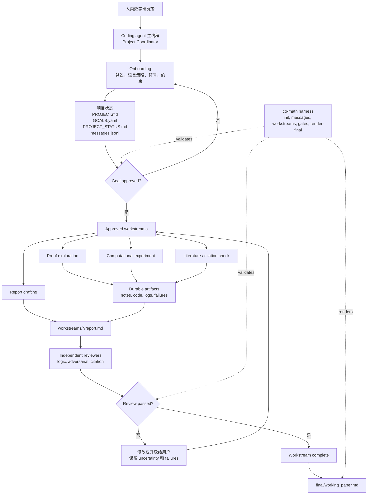

# Co-Mathematician Workspace

> [English](README.md) | 中文

<p align="center">
  
</p>

Co-Mathematician 是一个轻量级的数学研究工作区。`co-math` 命令安装一次后，每个
数学项目都放在独立、可长期维护的目录和可选 Git 仓库中。Codex、Claude Code、
Cursor、OpenCode 等能读取仓库的 coding agent 都使用同一套项目文件。

核心公式是：

```text
coding agent + repo filesystem + gates + reviewer loop = research workspace
```

本项目受 Google DeepMind
[AI Co-Mathematician 论文](https://arxiv.org/abs/2605.06651)中的公开设计原则启发，
但**不是**对其系统的复现。

## 这个工作区能做什么

Co-Mathematician 会把一次数学研究对话变成一个文件化项目：

- coding agent 主线程扮演 Project Coordinator
- `workspace/project/` 保存研究问题、目标、状态和消息
- `workspace/workstreams/` 保存证明、计算、文献、审查等分支工作
- reviewer agents 或独立 reviewer sessions 在完成前审查 report
- `workspace/final/working_paper.md` 只从通过审查的 reports 渲染

Python harness 不运行 agents。它只负责初始化文件、追加 messages、创建已批准
workstreams、检查 gates、渲染 final working paper。

## 安装并创建项目

clone Co-Math Core 并安装命令：

```bash
git clone https://github.com/VeryMath/co-mathematician.git
cd co-mathematician
python3 -m pip install -e .
co-math --help
```

指定所有数学项目的父目录。不执行这一步时，默认使用 `~/CoMathProjects`。

```bash
co-math setup --projects-home ~/CoMathProjects
```

创建第一个项目：

```bash
co-math new "Muon Convergence"
```

命令会返回新项目路径。用任意 coding agent 打开该目录，然后说：

```text
继续这个 Co-Math 项目。
```

每个新项目都包含：

```text
co-math.toml
AGENTS.md
CLAUDE.md
.agents/skills/co-mathematician/SKILL.md
workspace/
```

`.agents/skills/` 是唯一完整 Skill 的位置。支持 Agent Skills 的 coding agent 会
直接发现它；`AGENTS.md` 是通用入口，简短的 `CLAUDE.md` 让 Claude Code 指向同一
份说明。Co-Math 不为不同 coding agent 维护多套工作流。

### 日常项目流程

```bash
co-math list
co-math resume --project ~/CoMathProjects/Muon\ Convergence
co-math next --project ~/CoMathProjects/Muon\ Convergence
co-math archive --project ~/CoMathProjects/Muon\ Convergence
co-math reopen --project ~/CoMathProjects/Muon\ Convergence
```

项目 A 完成后先归档，再运行 `co-math new "Project B"`。项目 B 会得到新的目录、
workspace、Skill 和 Git 仓库，不会清空或复用项目 A 的研究文件。

### 让 Coding Agent 帮你设置

任何能执行终端命令的 coding agent 都可以完成设置：

```text
请从 https://github.com/VeryMath/co-mathematician.git 安装 Co-Math，
把 ~/CoMathProjects 设为项目目录，然后创建名为 Muon Convergence 的项目。
只返回项目路径，现在不要开始研究。
```

### Core 仓库内工作区

仓库自带的 `workspace/` 继续用于开发 Co-Math 本身和兼容旧流程：

```bash
co-math init --workspace workspace
PYTHONPATH=. python3 -m harness.co_math.cli --help
```

### 项目级 Skills

为了兼容 AI4Math 的大量 skill libraries 和项目特定研究流程，默认把 skills
安装或复制到当前仓库：

```text
.agents/skills/
```

registry scanner 会发现 `.agents/skills/<skill>/SKILL.md`，也会发现类似
`.agents/skills/<category>/<skill>/SKILL.md` 的嵌套布局。

只有当你明确想要“跨项目共享的个人安装”时，才使用 `~/.codex/skills` 或
`~/.agents/skills` 这样的全局 skill root。

例如，把本地 AI4Math skill library 放进这个工作区：

```bash
mkdir -p .agents/skills
rsync -a /path/to/AI4Math-Skill-Library/skills/ .agents/skills/
co-math refresh-skills --workspace workspace
co-math suggest-skills --workspace workspace --query "Stiefel manifold optimization"
```

`suggest-skills` 默认会先刷新项目级 registry，所以即使 coding agent 的原生 skill
registry 还没重新加载，新复制进来的 skills 也会被工作区看见。如果它推荐了相关
skill，就要求 Project Coordinator 在提出 goals 或创建 workstream 前先阅读对应的
`SKILL.md`。

如果用户决定让这个 Skill 接管内部任务流程，就记录 handoff：

```bash
co-math skill-handoff \
  --workspace workspace \
  --skill optimization-skill \
  --mode skill_guided \
  --reason "The task is an optimization modeling problem." \
  --query "Stiefel manifold optimization" \
  --skill-path ".agents/skills/optimization-skill/SKILL.md"
```

handoff 之后，内部步骤按 domain Skill 自己的流程走。只有当用户希望把任务提升为
durable research output 或 final working paper 时，才进入完整的
goal/workstream/reviewer 流程。

## 第一次交互

用 coding agent 打开新建的项目目录后，可以直接说：

```text
继续这个 Co-Math 项目。请读取 AGENTS.md 和 Co-Mathematician Skill，
运行 `co-math resume --project .`，然后带我完成 onboarding。
现在不要开始具体研究。
```

onboarding 的第一个偏好问题应该是文档语言策略：

1. 所有 workspace documents 都用英文。
2. research notes 用用户语言，schemas、gates、reviews 用英文。
3. 所有人类可读 research documents 都用用户语言。
4. 跟随每个 project 或 conversation 的语言。

## 开始一个数学研究项目

onboarding 开始后，再把问题背景给 agent：

```text
我想开始一个数学研究项目。

问题背景：
...

已知定义、符号和约束：
...

相关文献、文件或上下文：
...

请先 formalize research question，并提出 proposed goals。
现在不要创建 workstreams。
```

如果用户明确调用了某个 domain Skill，也可以进入 skill-guided mode。此时下一步
由该 Skill 自己的 opening、modeling 和 approval rules 控制；Co-Mathematician
只记录 handoff，并在任务被提升为研究项目时继续提供 provenance、uncertainty、
failures 和 final-paper gates。

Project Coordinator 应更新：

```text
workspace/project/PROJECT.md
workspace/project/GOALS.yaml
workspace/project/PROJECT_STATUS.md
workspace/project/messages.jsonl
```

draft goal 不可执行。只有当 goal 状态是下面这样，才能启动 workstream：

```yaml
status: approved
```

检查 goal gate：

```bash
co-math check-gate --workspace workspace --gate goal_approval --goal-id G1
```

在对话里明确 approve：

```text
我批准 goal G1，按当前写法执行。
你现在可以为 G1 创建 workstreams。
```

## 创建 Workstreams

goal approval 之后，再让 Project Coordinator 创建聚焦的 workstreams：

```text
请为已批准的 goal G1 创建一个 literature workstream。
这个 workstream 需要找出相关已知结果、精确的 theorem statements、
适用假设，以及 citation provenance。
```

或者：

```text
请为已批准的 goal G1 创建一个 proof exploration workstream。
请保存失败尝试，并在 report 中显式暴露 unresolved uncertainty。
```

harness 命令是：

```bash
co-math new-workstream \
  --workspace workspace \
  --goal-id G1 \
  --title "Literature baseline review" \
  --kind literature
```

允许的 workstream kind 是 `proof`、`computation`、`literature` 和 `review`。

每个 workstream report 应包含：

- 重要 claims 的 provenance
- 显式 uncertainty
- failed explorations
- `reviews/` 下的独立 reviewer output

检查 completion：

```bash
co-math check-gate \
  --workspace workspace \
  --gate workstream_completion \
  --workstream-id WS-G1-001-example
```

## 渲染 Working Paper

当 workstream reports 通过独立审查后，渲染 final working paper：

```bash
co-math render-final --workspace workspace
```

输出位置是：

```text
workspace/final/working_paper.md
```

这是 working paper，不是聊天总结。它应该保留 provenance、uncertainty、
failed explorations 和 reviewer status。

## 工作区框架



## Harness 命令

```bash
co-math setup --projects-home ~/CoMathProjects
co-math new "Project Name"
co-math list
co-math status --project /path/to/project
co-math resume --project /path/to/project
co-math next --project /path/to/project
co-math archive --project /path/to/project
co-math reopen --project /path/to/project
co-math init --workspace workspace
co-math refresh-skills --workspace workspace
co-math suggest-skills --workspace workspace --query "..."
co-math skill-handoff --workspace workspace --skill optimization-skill --mode skill_guided --reason "..." --query "..."
co-math append-message --workspace workspace --sender project_coordinator --recipient user --type status --content "..."
co-math new-workstream --workspace workspace --goal-id G1 --title "..." --kind proof
co-math check-gate --workspace workspace --gate goal_approval --goal-id G1
co-math check-gate --workspace workspace --gate workstream_completion --workstream-id WS-G1-001-example
co-math render-final --workspace workspace
```

## Coding Agent 兼容性

新建项目只使用一个标准 Skill 和一套命令。Core 仓库内的平台文件仅用于开发：

```text
agents/roles/       canonical, platform-neutral role cards
.codex/agents/      Codex TOML adapters
.claude/agents/     Claude Code Markdown subagent adapters
.cursor/rules/      Cursor project-rule adapters
```

| Coding agent | 新建项目入口 | 可选 Core 开发适配 |
| --- | --- | --- |
| 通用 repository-aware agent | `AGENTS.md`、`.agents/skills/co-mathematician/SKILL.md` | 不需要 |
| Codex | 同一套标准文件 | `.codex/` |
| Claude Code | `CLAUDE.md` 指向标准文件 | `.claude/` |
| Cursor 或 OpenCode | 同一套标准文件 | 项目生命周期不需要额外适配 |

如果你的 coding-agent 环境没有原生 subagent 功能，就使用 fresh reviewer prompt
或独立 session，并把 review 保存到 workstream 的 `reviews/` 目录。

## 新建项目结构

```text
co-math.toml
AGENTS.md
CLAUDE.md
.agents/skills/co-mathematician/
workspace/
```

## 源码检查

```bash
PYTHONDONTWRITEBYTECODE=1 PYTHONPATH=. python3 -m harness.co_math.cli --help
python3 -m pip wheel --no-deps --no-build-isolation .
```

## 许可证

MIT。见 `LICENSE`。
